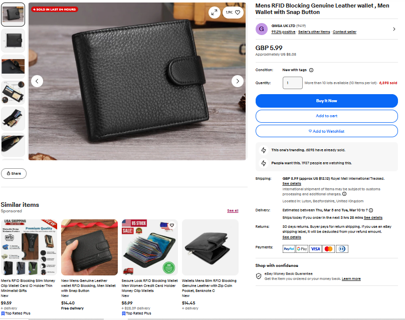

# Automated Playwright Test Suite



This repository is a **production‑grade Playwright automation framework** built as part of a QA skill assessment. It drives an e‑commerce site to verify core user flows and a custom "Best Sellers" recommendation feature on the product detail page.

## 🚀 Project Overview

The suite exercises three primary areas:

1. **Home / Landing Page** – search field behaviour, auto‑suggest, navigation links, categories, and advanced search.
2. **Search Results Page** – performing searches, pagination, sorting, empty queries, clicking into products, and URL/parameter validation.
3. **Main Product Page** – validating product details and **Best Sellers recommendations** (the assessment's focus).

Additional tests include an end‑to‑end flow that ties the three pages together.

> 📝 Non‑disclosure: No company names are referenced in this document; this is a generic open‑source QA example.

## 🛠 Tech Stack

- **Node.js** (JavaScript/ES6, CommonJS modules)
- **Playwright Test** framework for UI automation
- **Page Object Model** for maintainability
- **ESLint** + **Prettier** for linting/formatting
- **GitHub Actions** workflow for CI
- All tests run cross‑browser using Playwright's bundled browser installers

## 📦 Getting Started

### Prerequisites

- Node.js 18+ installed
- Git for cloning

### Clone & Setup

```bash
# clone repository
git clone <your-repo-url>
cd "Surge Global QA Assessment Playwright"

# install node dependencies and lockfile
npm install

# install browsers required by Playwright
npx playwright install --with-deps
```

### Run the Tests

```bash
# run full test suite headless
npm test

# run with headed browsers for debugging
npm run test:headed

# run and generate report
npm run test:report

# open the latest HTML report in your browser
npm run report:open
```

### Project Structure

```
.
├── pageobjects/      # Page object classes (Home, SearchResults, MainProduct)
├── tests/            # Playwright spec files grouped by page/feature
├── tests/e2eEndToEnd.spec.js  # full workflow test
├── package.json      # npm scripts & dependencies
├── playwright.config.js  # test configuration
└── README.md         # this file
```

## ✅ Features Tested

- Search field interaction, auto‑suggest, and category selection
- URL parameter validation after searches
- Handling of overlays/modals and dynamic DOM changes
- Best Sellers recommendation logic: presence, count, links, price range, currency consistency, navigation
- Edge cases: no results, long queries, sorting toggles, navigation back to search

## 🧩 Extending the Suite

To add more tests or pages:

1. Create a new page object in `pageobjects/`.
2. Write specs under `tests/` using `test.describe` blocks.
3. Use existing helpers (`openFirstResult`, etc.) for consistency.
4. Follow lint rules (`npm run lint`) and formatting (`npm run format`).

## 📁 Notes

- The repository contains screenshots/videos/traces generated during test failures in `test-results/` and `playwright-report/`.
- The framework is designed for clarity and reusability; feel free to adapt it to other websites.

---
*Happy testing!* 🎯
